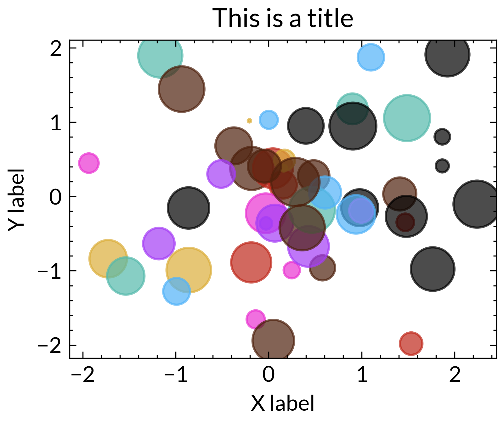

# CDHU Plots

This package provides a CDHU theme for `matplotlib` and `plotly`.  The
`matplotlib` implementation is based on
[`SciencePlots`](https://github.com/garrettj403/SciencePlots).

## Getting started

Install the package using `pip` directly from GitHub

``` bash
pip install git+
```

## Examples

``` python
# Matplotlib example
import cdhu_plots
import numpy as np
import matplotlib.pyplot as plt

with plt.style.context(['cdhu', 'scatter']):
    #fig, ax = plt.subplots()
    rng = np.random.RandomState(0)
    fig, ax = plt.subplots()
    for _ in range(10):
        x = rng.randn(5)
        y = rng.randn(5)
        #colors = rng.rand(100)
        sizes = 500 * rng.rand(5)
        ax.scatter(x, y, alpha=0.7, s = sizes)
    ax.set_xlabel("X label")
    ax.set_ylabel("Y label")
    ax.set_title("This is a title")
    plt.savefig("figures/plt_fig1.png", dpi=500)
```



